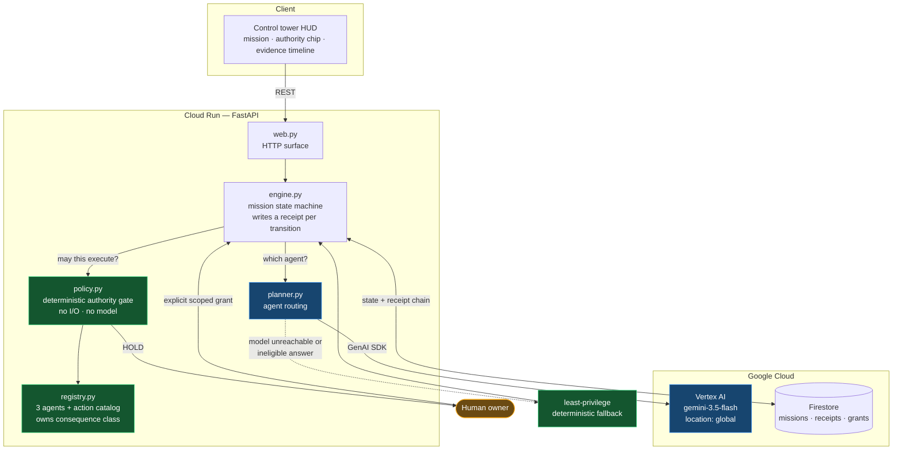
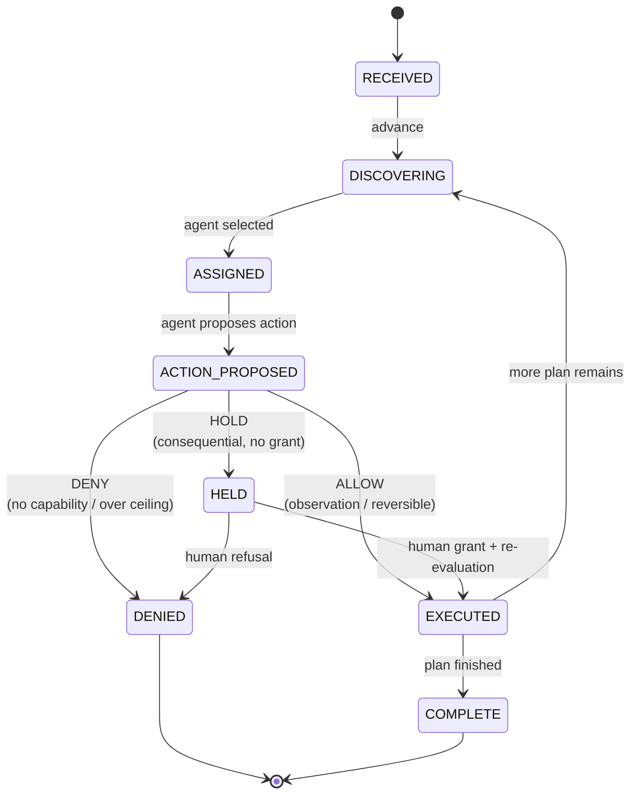
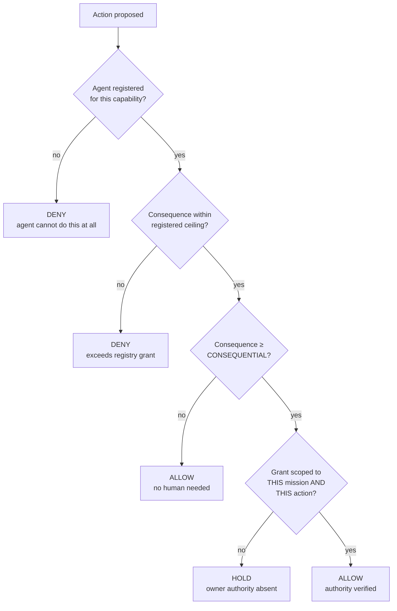

# Architecture

## The load-bearing decision

FleetProof separates two things that agent platforms usually conflate:

| Concern | Who decides | Where |
|---|---|---|
| Which agent should attempt this work? | Gemini 3.5 Flash | `planner.py` |
| May the resulting action actually execute? | Deterministic policy | `policy.py` |

`policy.py` performs no I/O and imports no model code. It cannot be reached by
a prompt, and it produces the same verdict for the same inputs every time.
That is what makes the authority gate testable and non-bypassable.



Green is deterministic. Blue is model-driven. Amber is human. Note that no blue
path reaches an effect without passing through green.

## Mission lifecycle



Two details that matter:

- `HELD --> EXECUTED` **re-runs the full policy evaluation** rather than
  trusting that a grant exists. The approval path and the refused path go
  through identical code; only the grant input differs.
- Execution records the action in `completed_actions` before returning, so a
  replayed approval or double-clicked button cannot produce a second external
  effect.

## Authority evaluation order



Capability is checked **before** authority deliberately. A missing capability
yields `DENY`, not `HOLD`, because escalating to a human for an action the agent
could never perform would be a false ask that trains people to rubber-stamp.

The gate is fail-closed: any path that does not affirmatively establish a
matching grant for a consequential action ends at `HOLD`.

## Evidence chain

```
receipt[n].parent_digest == receipt[n-1].digest
receipt[n].digest == SHA256(canonical_json(receipt[n].body))
```

Verification checks sequence continuity, parent linkage, and digest integrity,
so it detects modification of a past entry *and* removal of an entry from the
middle. Receipts are stored under a zero-padded sequence document ID and
written with a create-only operation, so a duplicate sequence collides rather
than silently forking the chain.

**Claim boundary:** this proves integrity relative to a retained head digest.
It is not a signature scheme and does not prove authorship. Ed25519-signed
receipts are the natural next increment.

## Extension points (not implemented)

Named here so they are read as future work rather than shipped capability:

- agent registry management and dynamic registration
- federated agent identity
- multi-mission scheduling and fleet-wide observability
- signed receipts and external anchoring
- real downstream connectors (effects are currently simulated)
